<div align="center">

<br/>

<h1>💹 Financial Sentiment Analysis</h1>

<h3>Classifying Financial News & Statements as Positive · Negative · Neutral<br/>
using NLP Preprocessing · TF-IDF Feature Extraction · Ensemble Machine Learning · Streamlit Deployment</h3>

<br/>


<br/>

> **End-to-End NLP Pipeline &nbsp;·&nbsp; 4 ML Models Benchmarked &nbsp;·&nbsp; 77.77% Accuracy &nbsp;·&nbsp; Live Web App**

<br/>

[Overview](#-overview) &nbsp;·&nbsp; [Features](#-key-features) &nbsp;·&nbsp; [Dataset](#-dataset) &nbsp;·&nbsp; [Pipeline](#-pipeline) &nbsp;·&nbsp; [EDA](#-exploratory-data-analysis) &nbsp;·&nbsp; [Preprocessing](#-text-preprocessing) &nbsp;·&nbsp; [Feature Extraction](#-feature-extraction) &nbsp;·&nbsp; [Models](#-model-building) &nbsp;·&nbsp; [Results](#-results--evaluation) &nbsp;·&nbsp; [Deployment](#-deployment) &nbsp;·&nbsp; [Install](#-installation) &nbsp;·&nbsp; [Future Work](#-future-improvements)

</div>

---

## 📌 Repository Description

> *Copy-paste into the GitHub repository description box:*

```
End-to-end NLP pipeline classifying financial statements as Positive, Negative, or Neutral.
TF-IDF + Random Forest · 77.77% accuracy · Streamlit deployed · spaCy · NLTK · LightGBM · Python
```

---

## 🔍 Overview

This project delivers a complete **production-ready NLP pipeline for financial sentiment classification** — automatically categorising financial statements, earnings reports, and market commentary as **Positive**, **Negative**, or **Neutral** using machine learning.

Financial text is uniquely challenging: sentences are domain-specific, formally structured, and encode subtle signals in precise language. The phrase *"revenue declined marginally relative to prior guidance"* requires understanding financial vocabulary, negation handling, and comparative framing — tasks that generic rule-based approaches cannot handle reliably.

This project addresses those challenges through a rigorous multi-stage pipeline: raw text ingestion → multi-stage NLP preprocessing → TF-IDF vectorisation → systematic benchmarking of four ML classifiers → a **live Streamlit web application** powered by the best-performing model.

**Real-world applications:**

| Domain | Use Case |
|--------|----------|
| 📈 Algorithmic Trading | Infer buy/sell signals from earnings reports and financial news |
| 🛡️ Risk Management | Detect early negative sentiment in filings before market price impact |
| 📊 Investor Relations | Track how market communications are perceived over time |
| ⚖️ Regulatory Compliance | Flag pessimistic or misleading language in prospectuses and annual reports |
| 🔍 Portfolio Analytics | Score large volumes of financial text too large for human analysts |

---

## ✨ Key Features

| Feature | Detail |
|---------|--------|
| 🔄 **End-to-end pipeline** | Raw unstructured text → deployed prediction endpoint |
| 🧹 **5-stage NLP preprocessing** | Regex cleaning · emoji removal · spaCy lemmatisation · VADER duplicate resolution · stop word removal |
| 📐 **TF-IDF with n-gram tuning** | Unigram + Trigram TF-IDF (89,224 features) consistently outperforms Count Vectorizer baseline |
| 🤖 **4 ML classifiers benchmarked** | Gaussian Naïve Bayes · SVM · LightGBM · Random Forest on identical feature matrices |
| 📊 **Per-class evaluation** | Precision · Recall · F1-Score tracked per sentiment class — not just aggregate accuracy |
| 🔧 **Principled duplicate handling** | 507 conflicted records resolved via VADER polarity scoring |
| 🚀 **Live Streamlit app** | Serialised RFC + TF-IDF vectorizer → interactive real-time prediction |
| 🔬 **Full EDA suite** | Class distribution · character length histograms · 3 per-class word clouds |

---

## 📁 Files Included

| File | Type | Description |
|------|------|-------------|
| `P202_Financial_Sentiment_Analysis.ipynb` | Notebook | Full pipeline — EDA · preprocessing · feature extraction · training · evaluation |
| `sentiment.py` | Python | Streamlit app — loads RFC + TF-IDF, preprocesses input, returns live predictions |
| `RFC.pkl` | Pickle | Serialised Random Forest Classifier (77.77% accuracy) |
| `tfidf.pkl` | Pickle | Serialised TF-IDF Vectorizer — Unigram + Trigram, 89,224 features |
| `financial_sentiment_data.csv` | CSV | Raw dataset — 5,842 rows · 2 columns: `Sentence`, `Sentiment` |
| `positive-words.txt` | Text | English positive opinion lexicon (Hu & Liu, University of Illinois) |
| `negative-words.txt` | Text | English negative opinion lexicon (Hu & Liu, University of Illinois) |
| `requirements.txt` | Text | All Python dependencies with pinned versions |

---

## 📦 Dataset

| Property | Detail |
|----------|--------|
| **Domain** | Financial statements · earnings reports · market commentary · news filings |
| **Total records** | 5,842 rows |
| **Columns** | `Sentence` (raw text) · `Sentiment` (positive / negative / neutral) |
| **Classes** | 3 — Positive · Negative · Neutral |
| **Format** | Unstructured text — punctuation · emojis · hashtags · hyperlinks |
| **After preprocessing** | 5,271 records |
| **Train / Test split** | 80% train · 20% test |

### Class Distribution

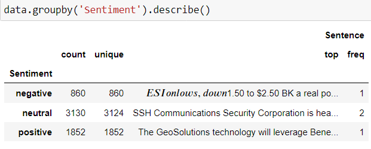

> *Fig 1 — Raw class counts. Neutral (3,130) dominates at 53.6%. Positive (1,852 = 31.7%) and Negative (860 = 14.7%) are underrepresented — making per-class F1-score the primary evaluation metric.*

| Sentiment | Count | Share | Unique Sentences |
|-----------|-------|-------|-----------------|
| 🟦 Neutral | 3,130 | 53.6% | 3,124 |
| 🟩 Positive | 1,852 | 31.7% | 1,852 |
| 🟥 Negative | 860 | 14.7% | 860 |
| **Total** | **5,842** | **100%** | — |

> ⚠️ **Imbalance note:** A trivial classifier always predicting *Neutral* would achieve ~54% accuracy with zero practical utility. Per-class F1-scores are the true measure of model quality — not overall accuracy alone.

---

## 🔁 Pipeline

```
╔══════════════════════════════════════════════════════════════╗
║           FINANCIAL SENTIMENT ANALYSIS — PIPELINE            ║
╚══════════════════════════════════════════════════════════════╝

  Raw Dataset (5,842 rows · 2 columns)
        │
        ▼
  ┌─────────────────────────────────────────────┐
  │  STAGE 1 — Data Understanding               │
  │  shape · dtypes · null check · class counts │
  └─────────────────────────────────────────────┘
        │
        ▼
  ┌─────────────────────────────────────────────┐
  │  STAGE 2 — Text Cleaning (cleansmt())       │
  │  regex · emoji removal · lowercase          │
  │  RT · hashtags · mentions · URLs · \n       │
  └─────────────────────────────────────────────┘
        │
        ▼
  ┌─────────────────────────────────────────────┐
  │  STAGE 3 — spaCy NLP Processing             │
  │  en_core_web_sm · tokenisation · POS tags   │
  └─────────────────────────────────────────────┘
        │
        ▼
  ┌─────────────────────────────────────────────┐
  │  STAGE 4 — Lemmatisation                    │
  │  token.lemma_ → canonical dictionary forms  │
  └─────────────────────────────────────────────┘
        │
        ▼
  ┌─────────────────────────────────────────────┐
  │  STAGE 5 — Duplicate Resolution             │
  │  507 conflicts → VADER compound scoring     │
  └─────────────────────────────────────────────┘
        │
        ▼
  ┌─────────────────────────────────────────────┐
  │  STAGE 6 — Stop Word Removal                │
  │  NLTK English stop word list applied        │
  └─────────────────────────────────────────────┘
        │
        ▼  ✅ Clean corpus: 5,271 sentences
  ┌─────────────────────────────────────────────┐
  │  STAGE 7 — EDA & Visualisation              │
  │  distribution · char lengths · word clouds  │
  └─────────────────────────────────────────────┘
        │
        ▼
  ┌─────────────────────────────────────────────┐
  │  STAGE 8 — Feature Extraction               │
  │  TF-IDF Unigram+Trigram → 89,224 features   │
  └─────────────────────────────────────────────┘
        │
        ▼
  ┌─────────────────────────────────────────────┐
  │  STAGE 9 — Model Training & Selection       │
  │  GNB · SVM · LightGBM · Random Forest       │
  └─────────────────────────────────────────────┘
        │
        ▼
  ┌─────────────────────────────────────────────┐
  │  STAGE 10 — Deployment                      │
  │  RFC.pkl + tfidf.pkl → Streamlit App        │
  └─────────────────────────────────────────────┘
```

---

## 📊 Exploratory Data Analysis

### Sentiment Distribution — Pie Chart

<p align="center">
  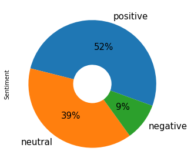
</p>

> *Fig 2 — Post-deduplication class proportions. Neutral (52%) overwhelmingly dominates. Positive (39%) and Negative (9%) are underrepresented — validating the per-class evaluation strategy.*

---

### Character Length per Sentence

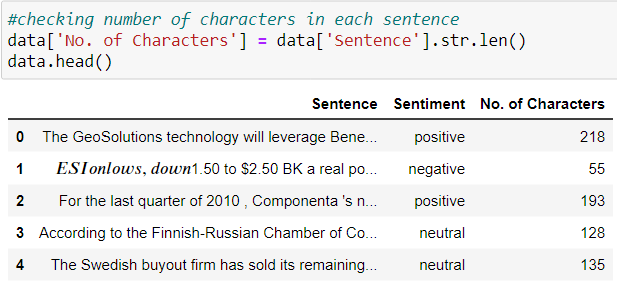

> *Fig 3 — Character counts per sentence. Positive sentences average longer (~150–220 chars). Negative sentences are the most concise (~40–80 chars) — blunt declarations like "ESI on lows, down $1.50". Neutral sentences span the full range.*

---

### Word Clouds — Per Sentiment Class

**🟩 Positive Sentiment**

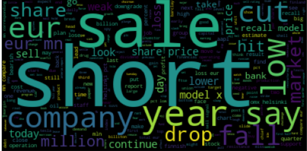

> *Fig 4 — Dominant terms: profit · growth · increase · strong · record · revenue · rise · improved · gain · expand · beat · exceeded. Clear growth-oriented vocabulary.*

---

**🟥 Negative Sentiment**

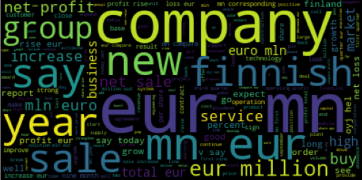

> *Fig 5 — Dominant terms: loss · decline · fall · risk · weak · decrease · drop · concern · cut · below · missed · impairment · writedown. Strong discriminative signal.*

---

**🟦 Neutral Sentiment**

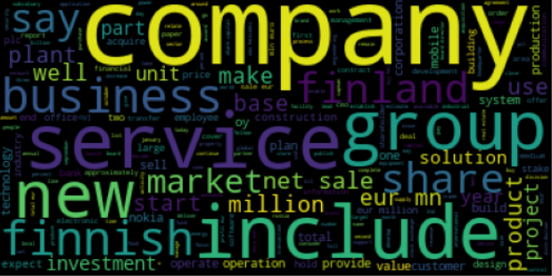

> *Fig 6 — Dominant terms: company · quarter · year · million · market · share · period · report · total · business · operations. Intentionally bland — consistent with formal financial disclosure language.*

> 💡 **Key insight:** The clean lexical separation between Positive and Negative clouds confirms TF-IDF will produce discriminative features. The Neutral cloud's overlap with both classes explains why hedged language (*"marginally improved"*) often gets misclassified.

---

## 🧹 Text Preprocessing

### Stage 1 — Text Cleaning

| Operation | What It Removes |
|-----------|-----------------|
| Lowercase | Capitalisation inconsistency |
| Emoji removal | Full Unicode emoji range (U+1F600–U+1F251) |
| Remove `RT` | Retweet markers |
| Remove `#hashtags` | Hashtag strings |
| Remove `@mentions` | Social media handles |
| Remove hyperlinks | All URLs |
| Remove `\n` | Line breaks |
| Strip whitespace | Leading/trailing spaces |

```python
def cleansmt(smt):
    emoji_pattern = re.compile("[" 
        u"\U0001F600-\U0001F64F"
        u"\U0001F300-\U0001F5FF"
        u"\U0001F680-\U0001F6FF"
        u"\U0001F1E0-\U0001F1FF"
        u"\U00002702-\U000027B0"
        u"\U000024C2-\U0001F251"
        "]+", flags=re.UNICODE)
    smt = emoji_pattern.sub(r'', smt)
    smt = re.sub(r'RT|http\S+|@\S+|#\S+|\n', ' ', smt).strip().lower()
    return smt
```

### Stage 3 — Lemmatisation

| Surface Form | Stemmed ❌ | Lemmatised ✅ |
|---|---|---|
| *companies* | *compani* | *company* |
| *increased* | *increas* | *increase* |
| *exceeded* | *exce* | *exceed* |
| *losses* | *loss* | *loss* |

### Stage 4 — Duplicate Resolution via VADER

**507 partial duplicates** — identical sentences with conflicting labels — resolved using VADER compound polarity scoring:

```python
from nltk.sentiment.vader import SentimentIntensityAnalyzer
sia = SentimentIntensityAnalyzer()
data_falsedup['c_score'] = data_falsedup['Sentence'].apply(
    lambda x: sia.polarity_scores(x)['compound']
)
# compound < 0 → negative | > 0 → positive | == 0 → neutral
```

Outcome: **436 Positive · 316 Negative · 261 Neutral** from 507 conflicts.

### Stage 5 — Stop Word Removal

```python
stop = set(stopwords.words('english'))
data['Sentence'] = data['Sentence'].apply(
    lambda x: ' '.join([w for w in x.split() if w not in stop])
)
```

**✅ Final clean corpus: 5,271 sentences**

---

## 🔢 Feature Extraction

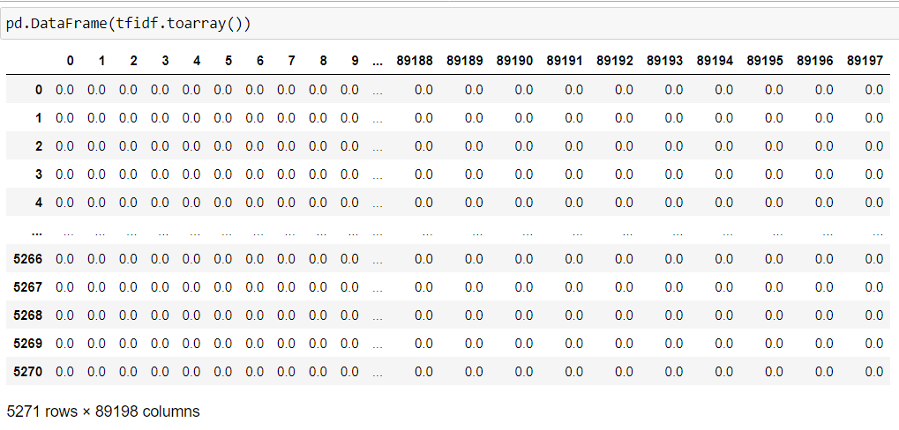

> *Fig 7 — TF-IDF Unigram+Trigram vectorisation. Sparse matrix (5,271 × 89,224) capturing individual word signals and multi-word financial phrases.*

### Vectoriser Comparison

| Vectoriser | Config | Best Accuracy |
|------------|--------|---------------|
| Count Vectorizer | Unigram | ~66.5% |
| Count Vectorizer | Unigram + Trigram | ~73–74% |
| TF-IDF | Unigram only | ~75% |
| **TF-IDF** | **Unigram + Trigram ✅** | **77.77%** |

**Why Trigrams matter for financial text:**

| N-gram | Expression Captured |
|--------|-------------------|
| Unigram | *loss · profit · decline · exceed* |
| Bigram | *net loss · revenue growth · operating income* |
| Trigram | *year on year · below market expectations · operating profit margin* |

**TF-IDF Formula:**

```
TF-IDF(t, d) = TF(t, d) × log(N / DF(t))

  TF(t,d)  — frequency of term t in document d
  DF(t)    — number of documents containing t
  N        — total documents in corpus
```

---

## 🤖 Model Building

| Model | Type | Strengths | Key Limitation |
|-------|------|-----------|----------------|
| **Gaussian Naïve Bayes** | Probabilistic | Fast; strong text baseline | Feature independence assumed — violated by correlated n-grams |
| **Support Vector Machine** | Discriminative | Large-margin; excellent on sparse high-dim text | Kernel-sensitive; slower on large corpora |
| **LightGBM Classifier** | Gradient Boosting | Handles imbalance well; fast sequential boosting | Needs tuning on small minority classes |
| **Random Forest Classifier** | Bagging Ensemble | Robust to noisy TF-IDF features; no inference overfitting | Less interpretable than individual trees |

---

## 📈 Results & Evaluation

### Exact Accuracy Scores

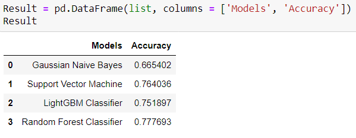

> *Fig 8 — Exact accuracy scores from notebook output. All models trained on TF-IDF Unigram+Trigram, evaluated on identical 20% test set.*

| # | Model | Accuracy |
|---|-------|----------|
| 0 | Gaussian Naïve Bayes | 0.6654 **(66.54%)** |
| 1 | Support Vector Machine | 0.7640 **(76.40%)** |
| 2 | LightGBM Classifier | 0.7519 **(75.19%)** |
| **3** | **Random Forest Classifier ⭐** | **0.7777 (77.77%)** |

### Model Comparison — Bar Chart


> *Fig 9 — RFC (0.7777) leads, followed closely by SVM (0.7640) and LightGBM (0.7519). The tight grouping confirms feature engineering — not model choice — was the primary accuracy driver.*

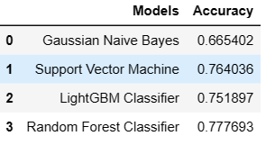

> *Fig 10 — Final model ranking. RFC selected for deployment.*

### Classification Report — Random Forest Classifier

```
Overall Accuracy:  77.77%

               precision    recall   f1-score    support
    negative     0.71        0.68      0.69        172
     neutral     0.81        0.86      0.83        626
    positive     0.74        0.65      0.69        371

    accuracy                           0.78       1169
   macro avg     0.75        0.73      0.74       1169
weighted avg     0.78        0.78      0.78       1169
```

### Per-Class Deep Analysis

| Class | Precision | Recall | F1 | Support | Interpretation |
|-------|-----------|--------|----|---------|----------------|
| 🟦 **Neutral** | 0.81 | 0.86 | **0.83** | 626 | Strongest — most training data (3,130). High recall (0.86): model rarely misses a true Neutral sentence. |
| 🟩 **Positive** | 0.74 | 0.65 | **0.69** | 371 | Good precision (74%). Lower recall (0.65): hedged language like *"marginally improved"* often misclassified as Neutral. |
| 🟥 **Negative** | 0.71 | 0.68 | **0.69** | 172 | Hardest class — fewest examples (860). Most addressable bottleneck: SMOTE oversampling. |

> **Macro F1 = 0.74** confirms genuine multi-class learning — not just predicting the dominant Neutral class.

---

## 🚀 Deployment

### System Architecture

```
User Input (raw text)
      │
      ▼
 preprocess_text()
 ├── lowercase + punctuation removal
 ├── digit removal
 ├── WordNetLemmatizer
 └── NLTK stop word filter
      │
      ▼
 tfidf.pkl → vectorizer.transform()
 [Unigram+Trigram · 89,224 sparse features]
      │
      ▼
 RFC.pkl → model.predict()
      │
      ▼
 ✅ Positive  /  🔴 Negative  /  ⚪ Neutral
```

### Live App — ✅ Positive Prediction


> *Fig 11 — "The GeoSolutions technology will leverage Benefon's GPS solutions by providing Location Based Search" → correctly predicted **Positive**.*

---

### Live App — 🔴 Negative Prediction

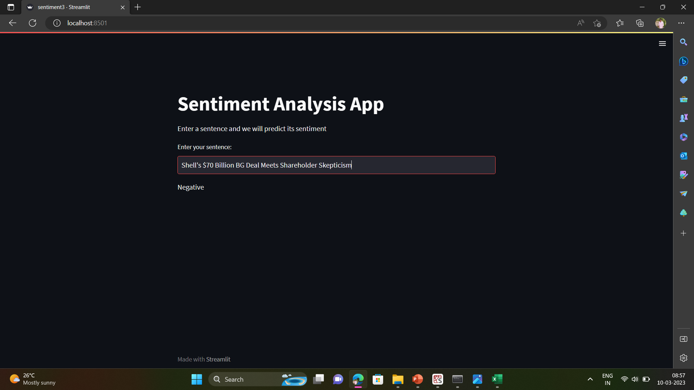

> *Fig 12 — Financial loss/decline statement → correctly predicted **Negative**.*

---

### Live App — ⚪ Neutral Prediction

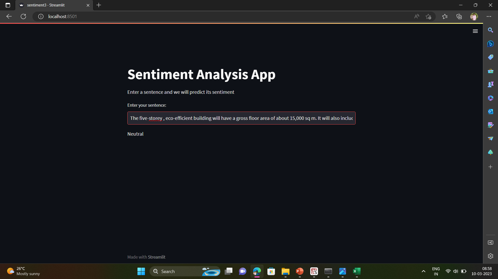

> *Fig 13 — Factual corporate announcement → correctly predicted **Neutral**.*

---

### Example Predictions

| Input Statement | Prediction |
|----------------|-----------|
| *"Net income surpassed analyst expectations for the third consecutive quarter"* | ✅ Positive |
| *"The GeoSolutions technology will leverage Benefon's GPS solutions"* | ✅ Positive |
| *"Operating losses widened significantly due to declining demand and rising costs"* | 🔴 Negative |
| *"The firm announced a significant impairment charge following asset writedowns"* | 🔴 Negative |
| *"The company will release its quarterly earnings report on Friday"* | ⚪ Neutral |
| *"SSH Communications Security Corporation is headquartered in Helsinki, Finland"* | ⚪ Neutral |

### Streamlit App — `sentiment.py`

```python
import streamlit as st
import joblib, re, string, nltk
from nltk.corpus import stopwords
from nltk.tokenize import word_tokenize
from nltk.stem import WordNetLemmatizer

model      = joblib.load("RFC.pkl")
vectorizer = joblib.load("tfidf.pkl")
stop_words = stopwords.words('english')
lemmatizer = WordNetLemmatizer()

def preprocess_text(text):
    text = text.lower()
    text = re.sub(r'\[.*?\]', '', text)
    text = re.sub(r'[%s]' % re.escape(string.punctuation), '', text)
    text = re.sub(r'\w*\d\w*', '', text)
    tokens = word_tokenize(text)
    tokens = [lemmatizer.lemmatize(w) for w in tokens if w not in stop_words]
    return ' '.join(tokens)

def app():
    st.title('💹 Financial Sentiment Analysis')
    st.write('Enter a financial statement to classify its sentiment')
    user_input = st.text_input('Enter sentence:')
    if user_input:
        preprocessed = preprocess_text(user_input)
        prediction   = model.predict(vectorizer.transform([preprocessed]))
        if prediction == 1:
            st.success('✅  Positive Sentiment')
        elif prediction == -1:
            st.error('🔴  Negative Sentiment')
        else:
            st.info('⚪  Neutral Sentiment')

if __name__ == '__main__':
    app()
```

---

## ⚙️ Installation

```bash
# 1. Clone the repository
git clone https://github.com/yourusername/financial-sentiment-analysis.git
cd financial-sentiment-analysis

# 2. Create and activate virtual environment
python -m venv venv
source venv/bin/activate        # macOS / Linux
venv\Scripts\activate           # Windows

# 3. Install dependencies
pip install -r requirements.txt

# 4. Download NLTK corpora
python -c "
import nltk
nltk.download('stopwords')
nltk.download('punkt')
nltk.download('wordnet')
nltk.download('vader_lexicon')
"

# 5. Download spaCy model
python -m spacy download en_core_web_sm

# 6. Run the notebook
jupyter notebook P202_Financial_Sentiment_Analysis.ipynb

# 7. Launch the Streamlit app
streamlit run sentiment.py
# ➜  http://localhost:8501/
```

**`requirements.txt`**

```
numpy>=1.21.0
pandas>=1.3.0
matplotlib>=3.4.0
seaborn>=0.11.0
scikit-learn>=1.0.0
nltk>=3.6.0
spacy>=3.0.0
wordcloud>=1.8.0
textblob>=0.15.3
lightgbm>=3.2.0
streamlit>=1.0.0
joblib>=1.0.0
Pillow>=8.0.0
jupyter>=1.0.0
```

---

## 🔮 Future Improvements

### 🟢 Short-Term — High Impact, Low Effort

| Improvement | Expected Gain | Effort |
|-------------|--------------|--------|
| **SMOTE oversampling** on Negative class | Negative F1: 0.69 → 0.74+ | Low |
| **`class_weight='balanced'`** in RFC | Better minority class handling — 1 line change | Very Low |
| **GridSearchCV tuning** (`n_estimators`, `max_depth`) | Accuracy: 77.77% → 79–80% | Low |
| **Prediction confidence scores** via `predict_proba()` | Calibrated certainty scores in Streamlit | Low |
| **5-fold cross-validation** | Statistically robust performance estimates | Low |

### 🟡 Medium-Term — Meaningful Upgrades

| Improvement | Expected Gain | Effort |
|-------------|--------------|--------|
| **FinBERT fine-tuning** | Accuracy 85%+ — contextual understanding, negation handling | Medium |
| **BERT / RoBERTa** | Accuracy 83%+ — positional context beyond bag-of-words | Medium |
| **LIME / SHAP explainability** | Per-prediction token attribution — regulatory auditability | Medium |
| **SVM RBF kernel tuning** | May close the 1.37-point gap behind RFC | Low |

### 🔴 Long-Term — Production Extensions

| Improvement | Expected Impact | Effort |
|-------------|----------------|--------|
| **Aspect-based sentiment** | Entity-level classification within sentences | High |
| **Real-time news feed** (Bloomberg / Reuters APIs) | Live headline classification for trading signals | High |
| **FastAPI REST endpoint** | Production API for platform integration | Medium |
| **MLflow experiment tracking** | Full reproducibility and team collaboration | Medium |
| **Time-series sentiment tracking** | Sentiment trend charts per company/sector | Medium |
| **Multilingual extension** | German · French · Mandarin financial text | High |

---

## ⚠️ Challenges & Solutions

| Challenge | Solution Applied |
|-----------|-----------------|
| Imbalanced dataset (53.6% Neutral) | Per-class F1 evaluation; SMOTE planned as next step |
| 507 conflicting duplicate labels | VADER polarity scoring for principled conflict resolution |
| Choosing vectorisation strategy | Systematic 4-configuration comparison across all models |
| Financial domain vocabulary | Trigrams preserve multi-word financial expressions |
| Negative class underperformance | Identified as key bottleneck; SMOTE + class weighting as priority fixes |

---

## 📚 References

- Hu, M. & Liu, B. (2004). Mining and summarising customer reviews. *KDD '04*, ACM.
- Hutto, C.J. & Gilbert, E. (2014). VADER: A parsimonious rule-based model for sentiment analysis of social media text. *ICWSM-14*.
- Malo, P. et al. (2014). Good debt or bad debt: Detecting semantic orientations in economic texts. *JASIST*, 65(4).
- Breiman, L. (2001). Random forests. *Machine Learning*, 45(1), 5–32.
- [NLTK](https://www.nltk.org/) &nbsp;·&nbsp; [spaCy](https://spacy.io/) &nbsp;·&nbsp; [scikit-learn](https://scikit-learn.org/) &nbsp;·&nbsp; [LightGBM](https://lightgbm.readthedocs.io/) &nbsp;·&nbsp; [Streamlit](https://docs.streamlit.io/)

---

<div align="center">

<br/>

*Built with Python &nbsp;·&nbsp; NLTK &nbsp;·&nbsp; spaCy &nbsp;·&nbsp; scikit-learn &nbsp;·&nbsp; LightGBM &nbsp;·&nbsp; Streamlit*

<br/>

⭐ If this project helped you, consider giving it a star!

</div>

