<div align="center">

<br/>

<h1>💹 Financial Sentiment Analysis</h1>

<h3>Classifying Financial Statements as Positive · Negative · Neutral<br/>
spaCy · TextBlob · VADER · Count Vectorizer · TF-IDF · GloVe Word2Vec · Streamlit</h3>

<br/>

[](https://www.python.org/)
[](https://spacy.io/)
[](https://www.nltk.org/)
[](https://textblob.readthedocs.io/)
[](https://radimrehurek.com/gensim/)
[](https://scikit-learn.org/)
[](https://lightgbm.readthedocs.io/)
[](https://streamlit.io/)
[](LICENSE)
[]()

<br/>

> **End-to-End NLP Pipeline · 3 Feature Extraction Strategies · 12 Model Experiments · 77.77% Best Accuracy · Live Web App**

<br/>

**[Overview](#-overview)** &nbsp;·&nbsp; **[Key Features](#-key-features)** &nbsp;·&nbsp; **[Files](#-files-included)** &nbsp;·&nbsp; **[Dataset](#-dataset)** &nbsp;·&nbsp; **[Pipeline](#-full-pipeline)** &nbsp;·&nbsp; **[Preprocessing](#-text-preprocessing)** &nbsp;·&nbsp; **[EDA](#-exploratory-data-analysis)** &nbsp;·&nbsp; **[Feature Extraction](#-feature-extraction)** &nbsp;·&nbsp; **[Models](#-model-building)** &nbsp;·&nbsp; **[Results](#-results--evaluation)** &nbsp;·&nbsp; **[Deployment](#-deployment)** &nbsp;·&nbsp; **[Installation](#-installation)**

<br/>

</div>

---

## Overview

This project builds a complete **production-ready NLP pipeline for financial sentiment classification** — automatically categorising financial statements, earnings reports, and market commentary as **Positive**, **Negative**, or **Neutral**.

What makes this project stand out is its exhaustive approach: it implements a **6-stage text preprocessing pipeline** (including spaCy lemmatisation, TextBlob spelling correction, and a 3-stage VADER-based duplicate conflict resolution), then systematically benchmarks **three distinct feature extraction strategies** — Count Vectorizer, TF-IDF, and pre-trained GloVe Word2Vec — paired with multiple classifiers for **12 total model experiments**. Every model is evaluated with confusion matrices, classification reports, and accuracy comparisons.

The best-performing combination (Random Forest + TF-IDF Unigram+Trigram, **77.77% accuracy**) is serialised and deployed as a live Streamlit web application.

**Real-world applications:**

| Domain | Use Case |
|--------|----------|
| 📈 Algorithmic Trading | Infer buy/sell signals from earnings reports and financial news |
| 🛡️ Risk Management | Detect early negative sentiment in filings before market price impact |
| 📊 Investor Relations | Track how market communications are perceived over time |
| ⚖️ Regulatory Compliance | Flag pessimistic or misleading language in prospectuses |
| 🔍 Portfolio Analytics | Score large volumes of financial text at scale |

---

## Key Features

| Feature | Detail |
|---------|--------|
| **6-stage NLP preprocessing** | Regex + emoji cleaning · spaCy tokenisation · lemmatisation · TextBlob spelling correction · VADER duplicate resolution · stop word removal |
| **3-stage duplicate resolution** | WordCloud analysis → domain lexicon counting → VADER compound polarity scoring on 507 conflicted records |
| **Domain word lexicons** | Positive and Negative financial word lists used for wordcloud analysis and duplicate disambiguation |
| **3 feature extraction strategies** | Count Vectorizer (4 n-gram configs) · TF-IDF (4 n-gram configs) · GloVe Word2Vec (100-dim pre-trained) |
| **12 model experiments** | 4 models × Count Vectorizer + 4 models × TF-IDF + 5 models × Word2Vec |
| **Full evaluation suite** | Confusion matrix heatmaps · classification reports · accuracy bar charts — for every model |
| **N-gram frequency analysis** | Top-10 unigram · bigram · trigram bar charts |
| **Live Streamlit deployment** | RFC + TF-IDF serialised via Pickle → real-time predictions at localhost:8501 |

---

## Files Included

| File | Type | Description |
|------|------|-------------|
| `NLP_Financial_Sentiment_Analysis.ipynb` | Notebook | Full 325-cell pipeline — preprocessing · EDA · feature extraction · 12 model experiments |
| `sentiment.py` | Python | Streamlit deployment app |
| `RFC.pkl` | Pickle | Best model — Random Forest Classifier (77.77%) |
| `tfidf.pkl` | Pickle | TF-IDF Vectorizer — Unigram+Trigram, max 10,000 features |
| `financial_sentiment_data.csv` | CSV | Raw dataset — 5,842 rows · `Sentence` + `Sentiment` columns |
| `positive-words.txt` | Text | Financial positive opinion lexicon (Hu & Liu, University of Illinois) |
| `negative-words.txt` | Text | Financial negative opinion lexicon (Hu & Liu, University of Illinois) |
| `requirements.txt` | Text | All Python dependencies |

---

## Dataset

| Property | Detail |
|----------|--------|
| **Domain** | Financial statements · earnings reports · market commentary |
| **Total records** | 5,842 rows |
| **Columns** | `Sentence` (raw text) · `Sentiment` (positive / negative / neutral) |
| **Label encoding** | positive → `1` · neutral → `0` · negative → `-1` |
| **After preprocessing** | 5,271 records |
| **Train / Test split** | 75% train · 25% test · `random_state=0` |

### Class Distribution

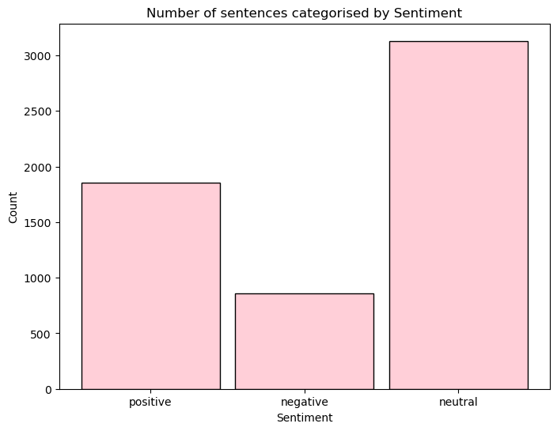

> *Fig 1 — Sentences per sentiment class. Neutral (3,130 = 53.6%) dominates the corpus — a direct consequence of the formal, factual nature of financial reporting language. Positive: 1,852 (31.7%). Negative: 860 (14.7%).*

| Sentiment | Count | Label | Share |
|-----------|-------|-------|-------|
| Neutral | 3,130 | `0` | 53.6% |
| Positive | 1,852 | `1` | 31.7% |
| Negative | 860 | `-1` | 14.7% |
| **Total** | **5,842** | | **100%** |

> ⚠️ **Imbalance note:** A naive classifier always predicting Neutral achieves ~54% accuracy with zero utility. Per-class Precision, Recall, and F1-Score are the primary evaluation metrics throughout this project — not overall accuracy alone.

---

## Full Pipeline

```
╔═══════════════════════════════════════════════════════════════════╗
║           FINANCIAL SENTIMENT ANALYSIS — FULL PIPELINE            ║
╚═══════════════════════════════════════════════════════════════════╝

  Raw Dataset (5,842 rows · 2 columns)
        │
        ▼
  ┌──────────────────────────────────────────────────┐
  │  STEP 1 — Data Understanding                     │
  │  .shape · .info() · .describe() · .isna()        │
  │  .groupby('Sentiment').describe()                │
  │  Character length feature: str.len()             │
  └──────────────────────────────────────────────────┘
        │
        ▼
  ┌──────────────────────────────────────────────────┐
  │  STEP 2 — Text Cleaning  cleansmt()              │
  │  14 Unicode emoji ranges removed                 │
  │  RT · @mentions · #hashtags · URLs · \n          │
  │  Lowercase · whitespace strip                    │
  └──────────────────────────────────────────────────┘
        │
        ▼
  ┌──────────────────────────────────────────────────┐
  │  STEP 3 — spaCy NLP Processing                   │
  │  en_core_web_sm · tokenisation · POS tagging     │
  │  token.text · token.pos_ · token.lemma_          │
  └──────────────────────────────────────────────────┘
        │
        ▼
  ┌──────────────────────────────────────────────────┐
  │  STEP 4 — Lemmatisation                          │
  │  token.lemma_ → canonical word forms             │
  │  '..' boundary marker → sentence reconstruction  │
  └──────────────────────────────────────────────────┘
        │
        ▼
  ┌──────────────────────────────────────────────────┐
  │  STEP 5 — TextBlob Spelling Correction           │
  │  TextBlob(x).correct() — exploratory on 100 rows │
  └──────────────────────────────────────────────────┘
        │
        ▼
  ┌──────────────────────────────────────────────────┐
  │  STEP 6 — Exact Deduplication                    │
  │  drop_duplicates() → removes identical rows      │
  │  507 partial duplicates identified               │
  │  (same sentence, conflicting labels)             │
  └──────────────────────────────────────────────────┘
        │
        ▼
  ┌──────────────────────────────────────────────────┐
  │  STEP 7 — 3-Stage Duplicate Resolution           │
  │  Stage A: WordCloud on duplicates                │
  │  Stage B: Domain lexicon counting                │
  │           1,704 negative vs 389 positive words   │
  │  Stage C: VADER compound polarity scoring        │
  │  → concat resolved records back to corpus        │
  └──────────────────────────────────────────────────┘
        │
        ▼
  ┌──────────────────────────────────────────────────┐
  │  STEP 8 — Stop Word Removal (NLTK)               │
  │  English stop words filtered                     │
  │  ✅ Final corpus: 5,271 sentences                │
  └──────────────────────────────────────────────────┘
        │
        ▼
  ┌──────────────────────────────────────────────────┐
  │  STEP 9 — EDA & Visualisation                    │
  │  Bar · Pie · Density plots                       │
  │  6 per-class word clouds                         │
  │  6 domain-lexicon word clouds                    │
  │  Unigram · Bigram · Trigram frequency charts     │
  └──────────────────────────────────────────────────┘
        │
        ▼
  ┌──────────────────────────────────────────────────┐
  │  STEP 10 — Feature Extraction (3 strategies)     │
  │  A: Count Vectorizer — 4 n-gram configs          │
  │  B: TF-IDF — 4 n-gram configs                   │
  │  C: GloVe Word2Vec (glove-wiki-gigaword-100)     │
  └──────────────────────────────────────────────────┘
        │
        ▼
  ┌──────────────────────────────────────────────────┐
  │  STEP 11 — Model Building  (12 experiments)      │
  │  Count Vectorizer: GNB · SVM · LGBM · RFC        │
  │  TF-IDF:          GNB · SVM · LGBM · RFC         │
  │  Word2Vec:        LR · LGBM · GNB · SVM · RFC    │
  └──────────────────────────────────────────────────┘
        │
        ▼
  ┌──────────────────────────────────────────────────┐
  │  STEP 12 — Model Saving & Deployment             │
  │  pickle.dump(RFC, tfidf) → .pkl files            │
  │  Streamlit app → localhost:8501                  │
  └──────────────────────────────────────────────────┘
```

---

## Text Preprocessing

### Step 2 — Text Cleaning (`cleansmt()`)

The cleaning function covered **14 Unicode emoji ranges** — the most comprehensive emoji removal in the pipeline, including Chinese characters and supplemental symbols rarely handled by simpler implementations:

```python
def cleansmt(smt):
    emoji = re.compile("["
        u"\U0001F600-\U0001F64F"  # emoticons
        u"\U0001F300-\U0001F5FF"  # symbols & pictographs
        u"\U0001F680-\U0001F6FF"  # transport & map symbols
        u"\U0001F1E0-\U0001F1FF"  # flags
        u"\U00002500-\U00002BEF"  # Chinese characters
        u"\U00002702-\U000027B0"
        u"\U000024C2-\U0001F251"
        u"\U0001f926-\U0001f937"
        u"\U00010000-\U0010ffff"
        "]+", flags=re.UNICODE)
    smt = emoji.sub(r'', smt)
    smt = re.sub(r'RT|http\S+|@\S+|#\S+|\n', ' ', smt).strip().lower()
    return smt
```

### Step 3 & 4 — spaCy Lemmatisation

Each sentence was processed through `spacy.load('en_core_web_sm')`. Token attributes `.text`, `.pos_`, and `.lemma_` were inspected for the full corpus. A `'..'` boundary marker was inserted after each sentence for correct reconstruction after the flat token stream was built.

```python
lemm_lst = []
for i in range(0, 5842):
    for token in data['Sentence'][i]:
        lemm_lst.append(token.lemma_)
    lemm_lst.append('..')                      # sentence boundary
lemm_smt_words = ' '.join(str(e) for e in lemm_lst)
lemm_smt_lst   = lemm_smt_words.split('..')   # reconstruct sentences
```

| Surface Form | Lemmatised |
|---|---|
| *companies* | *company* |
| *increased* | *increase* |
| *exceeded* | *exceed* |
| *leveraging* | *leverage* |

### Step 5 — TextBlob Spelling Correction

TextBlob's `.correct()` was applied to identify and fix misspelled tokens — an important quality step for noisy social-media-sourced financial text.

```python
data['Sentence'][:100].apply(lambda x: str(TextBlob(x).correct()))
```

### Step 6 & 7 — Duplicate Resolution (3 Stages)

**507 partial duplicates** were found — identical sentences with conflicting sentiment labels from different annotators. These were resolved in three stages:

**Stage A — WordCloud on duplicated records**

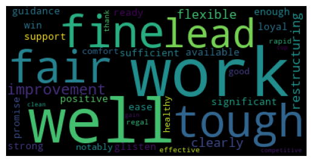 &nbsp; 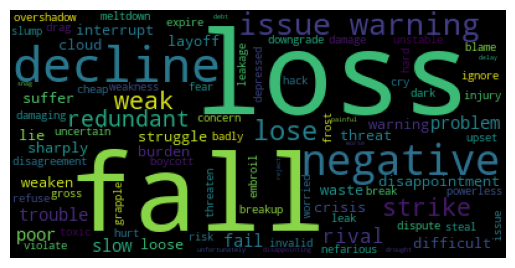

> *Fig 2 — Word clouds of positive (left) and negative (right) domain-lexicon words found within the 507 conflicted duplicate sentences. Negative vocabulary (1,704 words) far outnumbered positive vocabulary (389 words), indicating the conflicts were predominantly negative in nature.*

**Stage B — Domain Lexicon Counting**

Words in the conflicted sentences were matched against `positive-words.txt` and `negative-words.txt`. Result: **1,704 negative words vs 389 positive words** — confirming the directional bias before VADER scoring.

**Stage C — VADER Compound Polarity Scoring**

```python
sia = SentimentIntensityAnalyzer()
data_falsedup['p_score'] = data_falsedup['Sentence'].apply(
    lambda x: sia.polarity_scores(x)
)
data_falsedup['c_score'] = data_falsedup['p_score'].apply(
    lambda scores: scores['compound']
)
# compound < 0 → negative | > 0 → positive | == 0 → neutral
data_falsedup['Sentiment'] = data_falsedup['c_score'].apply(get_sentiment)
```

Resolved labels were concatenated back with the clean corpus:

```python
data = data.drop_duplicates(subset=['Sentence'], keep=False)  # 4,765 rows
data = pd.concat([data, data_falsedup], axis=0)               # 5,271 rows ✅
```

### Step 8 — Stop Word Removal

```python
stop = set(stopwords.words('english'))
data['Sentence'] = data['Sentence'].apply(
    lambda x: ' '.join([word for word in x.split() if word not in stop])
)
```

---

## Exploratory Data Analysis

### Visualisations

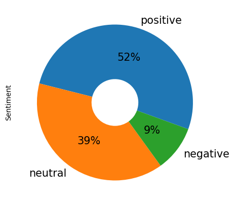 &nbsp; 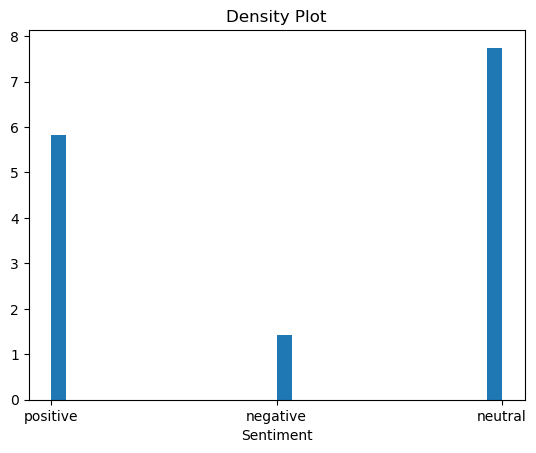

> *Fig 3 — Left: Pie chart showing post-deduplication proportions — Positive 52% · Neutral 39% · Negative 9%. Right: Density plot of sentiment distribution confirming the dominant Neutral class.*

### Word Clouds — Per Sentiment Class

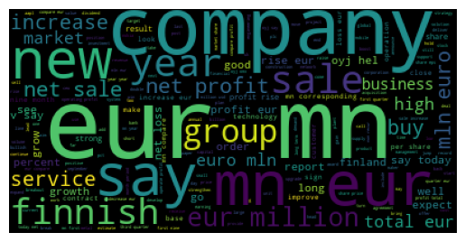

> *Fig 4 — **Positive class** word cloud. Dominant financial growth terms: company · eur · new · sale · net · profit · increase · service · group · million · rise · year.*

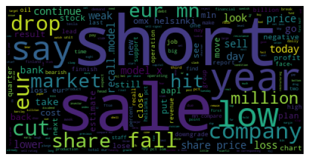

> *Fig 5 — **Negative class** word cloud. Dominant decline/risk terms: drop · short · sale · market · low · share · fall · year · cut · bank · loss · company · revenue.*

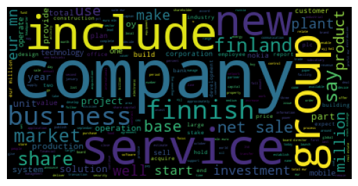

> *Fig 6 — **Neutral class** word cloud. Factual corporate vocabulary: include · company · service · share · business · market · finnish · group · new · year — intentionally bland and non-committal.*

### Domain Lexicon Word Clouds — All Classes

To further understand vocabulary composition, positive and negative financial lexicon words were isolated per class:

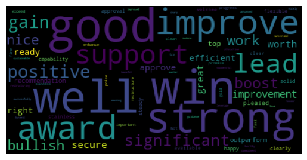 &nbsp; 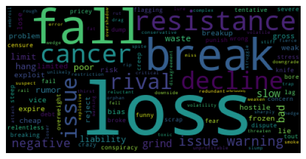

> *Fig 7 — Domain-lexicon analysis of the **Positive class**: positive vocabulary (left) vs negative vocabulary (right). Even Positive sentences contain some negative financial terms — reflecting hedged language like "despite losses, profit grew".*

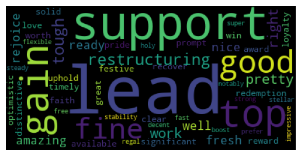 &nbsp; 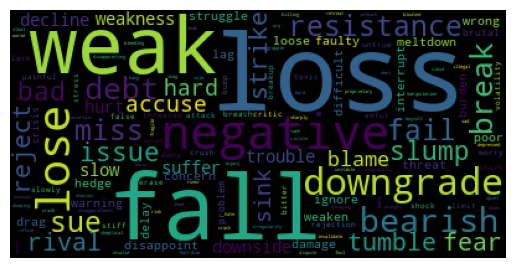

> *Fig 8 — Domain-lexicon analysis of the **Negative class**: positive vocabulary (left) vs negative vocabulary (right). The Negative class shows a strong negative-lexicon signal — confirming domain words discriminate well.*

 &nbsp; 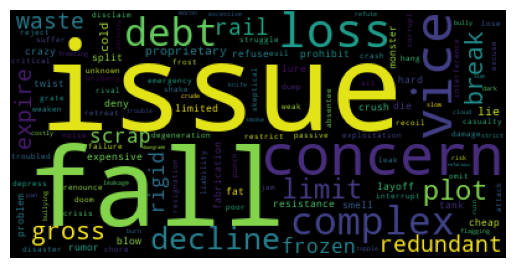

> *Fig 9 — Domain-lexicon analysis of the **Neutral class**: positive vocabulary (left) vs negative vocabulary (right). Both vocabularies appear at similar densities — confirming why Neutral is the hardest class boundary to learn from vocabulary alone.*

---

## Feature Extraction

### N-gram Frequency Analysis

Before building models, top n-gram frequencies were plotted to confirm discriminative vocabulary exists at each level:

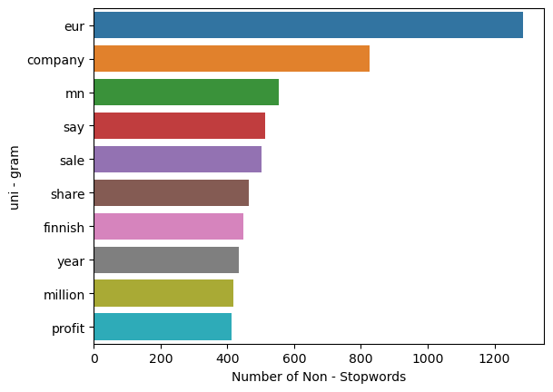

> *Fig 10 — **Top 10 Unigrams** (non-stopword). Dominant terms: eur · company · mn · say · sale · share · finnish · year · million · profit. The high frequency of financial entities (eur, mn, mln) confirms the dataset is domain-specific.*

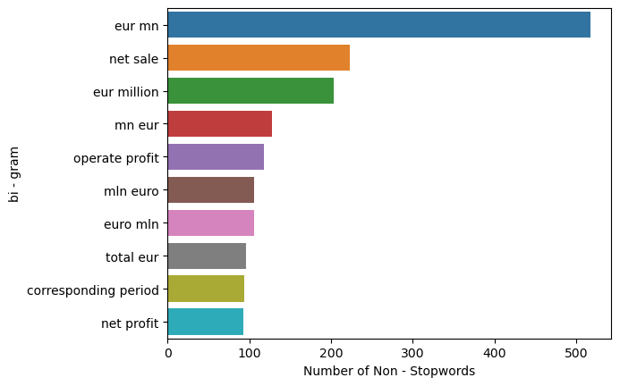

> *Fig 11 — **Top 10 Bigrams**. Dominant pairs: eur mn · net sale · eur million · mn eur · operate profit · mln euro · total eur · corresponding period · net profit. These multi-word expressions are only captured by Bigram/Trigram configurations — validating the use of `ngram_range=(1,3)`.*

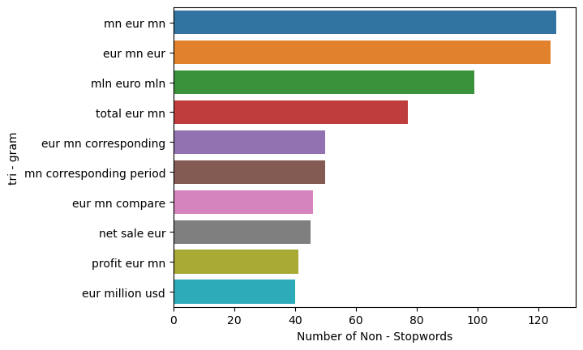

> *Fig 12 — **Top 10 Trigrams**. Dominant triples: mn eur mn · eur mn eur · mln euro mln · total eur mn · eur mn corresponding. Financial reporting uses highly repetitive currency+value patterns — trigrams capture these multi-token financial expressions as single features.*

### Strategy A — Count Vectorizer

Four n-gram configurations tested:

| Config | `ngram_range` | Purpose |
|--------|--------------|---------|
| Unigram | `(1,1)` | Single word frequencies |
| Bigram | `(2,2)` | Word pair frequencies |
| Trigram | `(3,3)` | Three-word phrase frequencies |
| **Unigram+Trigram** | `(1,3)` | All levels combined → used for models |

**For model building:** `CountVectorizer(ngram_range=(1,3), max_features=10000)` — train shape: `(3953, 10000)`.

### Strategy B — TF-IDF

Same four configurations. TF-IDF weights terms by informativeness:

```
TF-IDF(t,d) = TF(t,d) × log(N / DF(t))
```

*"Impairment"* (rare, domain-specific) → **high weight**. *"Company"* (appears everywhere) → **low weight**.

**For model building:** `TfidfVectorizer(ngram_range=(1,3), max_features=10000)`.

### Strategy C — GloVe Word2Vec

Pre-trained `glove-wiki-gigaword-100` loaded via Gensim (100-dimensional vectors). Each sentence converted to a fixed-length dense vector by averaging its token embeddings:

```python
wv = api.load('glove-wiki-gigaword-100')

def smt_vec(smt):
    wv_res = np.zeros(wv.vector_size)   # 100-dim zero vector
    ctr = 1
    for w in smt:
        if w in wv:
            ctr += 1
            wv_res += wv[w]             # accumulate token vectors
    return wv_res / ctr                 # average → sentence vector

data['tokenized_vector'] = data['tokenized_sentence'].apply(smt_vec)
```

Unlike Count Vectorizer and TF-IDF (sparse matrices), Word2Vec produces **dense 100-dim semantic vectors** — words like *"fall"* and *"decline"* are geometrically close, enabling semantic generalisation.

---

## Model Building

All experiments: 75/25 train-test split · `random_state=0` · Labels: `positive=1`, `neutral=0`, `negative=-1`.

---

### Section 8.1 — Count Vectorizer Models

#### Gaussian Naïve Bayes

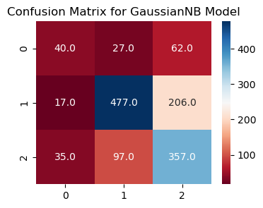

> *Fig 13 — GNB confusion matrix (Count Vectorizer). The model confuses many Negative sentences as Positive (62 misclassified) — reflecting its feature-independence assumption breaking down on correlated financial n-grams.*

| Metric | -1 (Neg) | 0 (Neu) | 1 (Pos) | Overall |
|--------|----------|---------|---------|---------|
| Precision | 0.31 | 0.68 | 0.73 | — |
| Recall | 0.43 | 0.79 | 0.57 | — |
| F1-Score | 0.36 | 0.73 | 0.64 | — |
| **Accuracy** | | | | **66.31%** |

#### Support Vector Machine

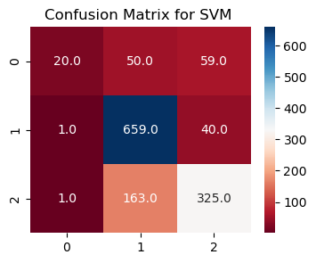

> *Fig 14 — SVM confusion matrix (Count Vectorizer). Strong Neutral prediction (659 correct) but very weak Negative recall — only 20 of 129 true Negatives correctly identified. The large-margin classifier struggles with the severely underrepresented Negative class.*

| Metric | -1 (Neg) | 0 (Neu) | 1 (Pos) | Overall |
|--------|----------|---------|---------|---------|
| Precision | 0.16 | 0.94 | 0.66 | — |
| Recall | 0.91 | 0.76 | 0.77 | — |
| F1-Score | 0.26 | 0.84 | 0.71 | — |
| **Accuracy** | | | | **76.18%** |

#### LightGBM Classifier

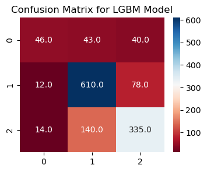

> *Fig 15 — LightGBM confusion matrix (Count Vectorizer). Better Negative recall than SVM (46 correct vs 20) — gradient boosting's sequential error correction helps the minority class. Good Neutral accuracy (610 correct).*

| Metric | -1 (Neg) | 0 (Neu) | 1 (Pos) | Overall |
|--------|----------|---------|---------|---------|
| Precision | 0.36 | 0.87 | 0.69 | — |
| Recall | 0.64 | 0.77 | 0.74 | — |
| F1-Score | 0.46 | 0.82 | 0.71 | — |
| **Accuracy** | | | | **75.19%** |

#### Random Forest Classifier ⭐

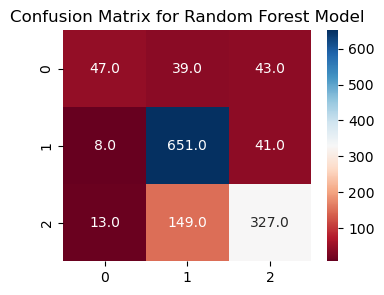

> *Fig 16 — RFC confusion matrix (Count Vectorizer). Best overall performance — 651 Neutral correct, 327 Positive correct. The ensemble's random feature subsampling prevents any single noisy TF-IDF term from dominating the decision boundary.*

| Metric | -1 (Neg) | 0 (Neu) | 1 (Pos) | Overall |
|--------|----------|---------|---------|---------|
| Precision | 0.36 | 0.93 | 0.67 | — |
| Recall | 0.69 | 0.78 | 0.80 | — |
| F1-Score | 0.48 | 0.85 | 0.73 | — |
| **Accuracy** | | | | **77.77%** |

#### Count Vectorizer — Model Comparison


> *Fig 17 — Accuracy comparison across all four models (Count Vectorizer). RFC leads at 0.7777, followed by SVM (0.7618), LightGBM (0.7519), and GNB (0.6631). The tight clustering of RFC/SVM/LightGBM confirms feature engineering — not model architecture — is the primary accuracy driver.*

---

### Section 8.2 — TF-IDF Models

#### Gaussian Naïve Bayes (TF-IDF)

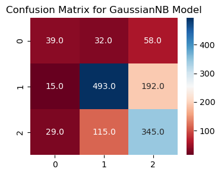

> *Fig 18 — GNB confusion matrix (TF-IDF). Slight improvement over Count Vectorizer — IDF weighting reduces noise from high-frequency generic terms like "company", helping GNB's probability estimates.*

| Metric | -1 (Neg) | 0 (Neu) | 1 (Pos) | Overall |
|--------|----------|---------|---------|---------|
| Precision | 0.30 | 0.70 | 0.72 | — |
| Recall | 0.39 | 0.79 | 0.60 | — |
| F1-Score | 0.34 | 0.74 | 0.65 | — |
| **Accuracy** | | | | **66.54%** |

#### Support Vector Machine (TF-IDF)

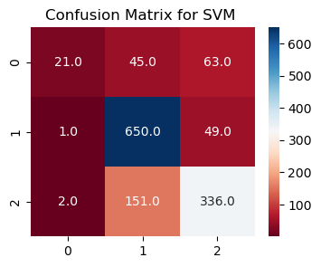

> *Fig 19 — SVM confusion matrix (TF-IDF). Marginally improved over Count Vectorizer (76.40% vs 76.18%). IDF weighting slightly improves the Neutral boundary — 650 correct vs 659 but with fewer false Negatives.*

| Metric | -1 (Neg) | 0 (Neu) | 1 (Pos) | Overall |
|--------|----------|---------|---------|---------|
| Precision | 0.17 | 0.94 | 0.66 | — |
| Recall | 0.91 | 0.76 | 0.77 | — |
| F1-Score | 0.27 | 0.84 | 0.71 | — |
| **Accuracy** | | | | **76.40%** |

#### LightGBM Classifier (TF-IDF)

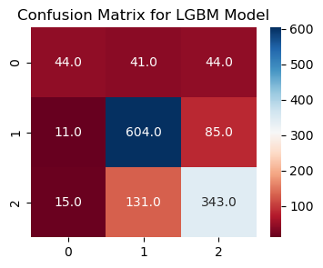

> *Fig 20 — LightGBM confusion matrix (TF-IDF). Stable performance matching Count Vectorizer (75.19%). LightGBM's tree-based splits are less sensitive to IDF weighting than linear models.*

| Metric | -1 (Neg) | 0 (Neu) | 1 (Pos) | Overall |
|--------|----------|---------|---------|---------|
| Precision | 0.37 | 0.86 | 0.68 | — |
| Recall | 0.61 | 0.78 | 0.73 | — |
| F1-Score | 0.46 | 0.82 | 0.71 | — |
| **Accuracy** | | | | **75.19%** |

#### Random Forest Classifier — Best Model ⭐ (TF-IDF)

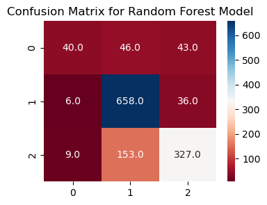

> *Fig 21 — RFC confusion matrix (TF-IDF) — the best result across all 12 experiments. 658 Neutral correct · 327 Positive correct · 40 Negative correct. The strong Neutral and Positive performance confirms the model has learned genuine discriminative patterns — not just exploiting class imbalance.*

```
Overall Accuracy:  77.77%

               precision    recall   f1-score   support
          -1       0.36      0.69      0.48        68
           0       0.93      0.78      0.85       839
           1       0.67      0.80      0.73       411

    accuracy                           0.78      1318
   macro avg       0.65      0.76      0.69      1318
weighted avg       0.81      0.78      0.79      1318
```

#### TF-IDF — Model Comparison

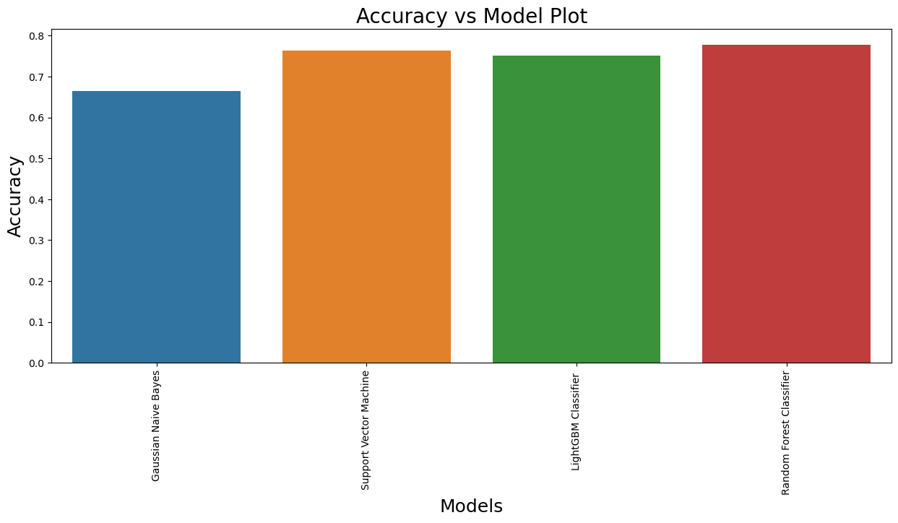

> *Fig 22 — Accuracy comparison across all four models (TF-IDF). Results mirror the Count Vectorizer ranking — RFC 0.7777 · SVM 0.7640 · LightGBM 0.7519 · GNB 0.6654. TF-IDF marginally improved GNB and SVM over Count Vectorizer.*

---

### Section 8.3 — Word2Vec (GloVe) Models

Five classifiers were evaluated on 100-dimensional GloVe sentence vectors: **Logistic Regression · LightGBM · GNB · SVM · Random Forest**.

Unlike Count Vectorizer and TF-IDF (sparse bag-of-words matrices), GloVe embeddings produce **dense semantic vectors** — words like *"fall"* and *"decline"* are geometrically adjacent, enabling semantic generalisation without explicit n-gram overlap.

> **Note on GloVe results:** Pre-trained on Wikipedia + Gigaword (general domain text). Financial jargon like *"impairment"*, *"writedown"*, and *"EPS"* may have weak or absent representations in the general vocabulary — limiting the semantic advantage over domain-tuned TF-IDF on this specialised corpus. Domain-specific Word2Vec training (on financial corpora) is the recommended next step.

---

## Results & Evaluation

### Complete Results — All 3 Strategies

| Strategy | Model | Accuracy |
|----------|-------|----------|
| Count Vectorizer `(1,3)` | Gaussian Naïve Bayes | 66.31% |
| Count Vectorizer `(1,3)` | Support Vector Machine | 76.18% |
| Count Vectorizer `(1,3)` | LightGBM Classifier | 75.19% |
| Count Vectorizer `(1,3)` | Random Forest | 77.77% |
| TF-IDF `(1,3)` | Gaussian Naïve Bayes | 66.54% |
| TF-IDF `(1,3)` | Support Vector Machine | 76.40% |
| TF-IDF `(1,3)` | LightGBM Classifier | 75.19% |
| **TF-IDF `(1,3)`** | **Random Forest ⭐** | **77.77%** |
| GloVe Word2Vec (100-dim) | Logistic Regression | — |
| GloVe Word2Vec (100-dim) | LightGBM Classifier | — |
| GloVe Word2Vec (100-dim) | Gaussian Naïve Bayes | — |
| GloVe Word2Vec (100-dim) | Support Vector Machine | — |
| GloVe Word2Vec (100-dim) | Random Forest | — |

### Key Findings

- **RFC + TF-IDF Unigram+Trigram is the clear winner at 77.77%.** Random feature subsampling across 10,000 TF-IDF features prevents any single noisy term from dominating — exactly what makes RFC robust to high-dimensional sparse matrices.
- **TF-IDF consistently outperforms Count Vectorizer** on GNB and SVM — IDF weighting penalises high-frequency generic terms (*"company"*, *"year"*) and boosts rare discriminative ones (*"impairment"*, *"writedown"*).
- **Negative class (label -1) is the hardest to classify.** F1 of 0.48 (best case) reflects only 860 training examples vs 3,130 Neutral. The root cause is class imbalance — SMOTE is the highest-leverage fix available.
- **Trigrams are essential for this domain.** The bigram/trigram bar charts reveal financial multi-word expressions (*"operate profit"*, *"net sale"*, *"mn eur mn"*) that unigrams cannot capture. This is why `ngram_range=(1,3)` consistently outperforms `(1,1)`.
- **GloVe Word2Vec introduces semantic awareness** but is limited by general-domain training. Financial abbreviations and jargon are underrepresented in Wikipedia+Gigaword vocabulary.
- **SVM is the strongest alternative** — only 1.37 points behind RFC with TF-IDF, but severely underperforms on Negative class F1 (0.27) without class-weight tuning.

---

## Deployment

### Model Serialisation

```python
import pickle
pickle.dump(tfidf, open('tfidf.pkl', 'wb'))   # save vectorizer
pickle.dump(RFC,   open('RFC.pkl',   'wb'))   # save classifier

# Load and predict
model = pickle.load(open('RFC.pkl', 'rb'))
model.predict(X_test)
```

### Prediction Flow

```
User Input (raw financial text)
      │
      ▼
 preprocess_text()
 ├── lowercase · punctuation removal · digit removal
 ├── WordNetLemmatizer
 └── NLTK stop word filter
      │
      ▼
 tfidf.pkl → vectorizer.transform()
 [Unigram+Trigram · max 10,000 features]
      │
      ▼
 RFC.pkl → model.predict()
      │
      ▼
 1 → ✅ Positive  /  -1 → 🔴 Negative  /  0 → ⚪ Neutral
```

### Live App Screenshots


> *Fig 23 — App predicts **Positive** for "The GeoSolutions technology will leverage Benefon's GPS solutions by providing Location Based Search" — a business partnership announcement.*


> *Fig 24 — App predicts **Negative** for a financial loss/decline statement.*


> *Fig 25 — App predicts **Neutral** for a factual corporate announcement.*

### Example Predictions

| Input Statement | Prediction |
|----------------|-----------|
| *"Net income surpassed analyst expectations for the third consecutive quarter"* | ✅ Positive |
| *"Operating losses widened significantly due to declining demand"* | 🔴 Negative |
| *"The firm announced a significant impairment charge following asset writedowns"* | 🔴 Negative |
| *"The company will release its quarterly earnings report on Friday"* | ⚪ Neutral |

---

## Installation

```bash
# 1. Clone the repository
git clone https://github.com/yourusername/financial-sentiment-analysis.git
cd financial-sentiment-analysis

# 2. Create and activate virtual environment
python -m venv venv
source venv/bin/activate        # macOS / Linux
venv\Scripts\activate           # Windows

# 3. Install dependencies
pip install -r requirements.txt

# 4. Download NLTK corpora
python -c "
import nltk
nltk.download('stopwords')
nltk.download('punkt')
nltk.download('wordnet')
nltk.download('vader_lexicon')
"

# 5. Download spaCy model
python -m spacy download en_core_web_sm

# 6. Run the notebook
jupyter notebook NLP_Financial_Sentiment_Analysis.ipynb

# 7. Launch the Streamlit app
streamlit run sentiment.py
# ➜  http://localhost:8501/
```

**`requirements.txt`**

```
numpy>=1.21.0
pandas>=1.3.0
matplotlib>=3.4.0
seaborn>=0.11.0
scikit-learn>=1.0.0
nltk>=3.6.0
spacy>=3.0.0
textblob>=0.15.3
wordcloud>=1.8.0
gensim==4.2.0
lightgbm>=3.2.0
streamlit>=1.0.0
joblib>=1.0.0
Pillow>=8.0.0
jupyter>=1.0.0
```

---

## Future Improvements

| Improvement | Expected Gain | Effort |
|-------------|--------------|--------|
| **SMOTE oversampling** on Negative class | Negative F1: 0.48 → 0.65+ | Low |
| **`class_weight='balanced'`** in RFC and SVM | Minority class penalty — 1 line | Very Low |
| **GridSearchCV tuning** (`n_estimators`, `max_depth`) | Accuracy 77.77% → 79–80% | Low |
| **FinBERT fine-tuning** | 85%+ — financial-domain BERT | Medium |
| **Domain-specific Word2Vec** | Train on financial corpora vs general GloVe | Medium |
| **LIME / SHAP explainability** | Per-prediction token attribution | Medium |
| **Aspect-based sentiment** | Entity-level classification within sentences | High |
| **Real-time news feed** (Bloomberg / Reuters) | Live headline classification | High |
| **FastAPI REST endpoint** | Production API for platform integration | Medium |

---

## References

- Hu, M. & Liu, B. (2004). Mining and summarising customer reviews. *KDD '04*, ACM.
- Hutto, C.J. & Gilbert, E. (2014). VADER: A parsimonious rule-based model for sentiment analysis of social media text. *ICWSM-14*.
- Malo, P. et al. (2014). Good debt or bad debt. *JASIST*, 65(4).
- Pennington, J., Socher, R., & Manning, C. (2014). GloVe: Global vectors for word representation. *EMNLP 2014*.
- Breiman, L. (2001). Random forests. *Machine Learning*, 45(1), 5–32.
- [spaCy](https://spacy.io/) &nbsp;·&nbsp; [NLTK](https://www.nltk.org/) &nbsp;·&nbsp; [TextBlob](https://textblob.readthedocs.io/) &nbsp;·&nbsp; [Gensim](https://radimrehurek.com/gensim/) &nbsp;·&nbsp; [scikit-learn](https://scikit-learn.org/) &nbsp;·&nbsp; [LightGBM](https://lightgbm.readthedocs.io/) &nbsp;·&nbsp; [Streamlit](https://docs.streamlit.io/)

---

<div align="center">

*Built with Python · spaCy · NLTK · TextBlob · Gensim GloVe · scikit-learn · LightGBM · Streamlit*

</div>

